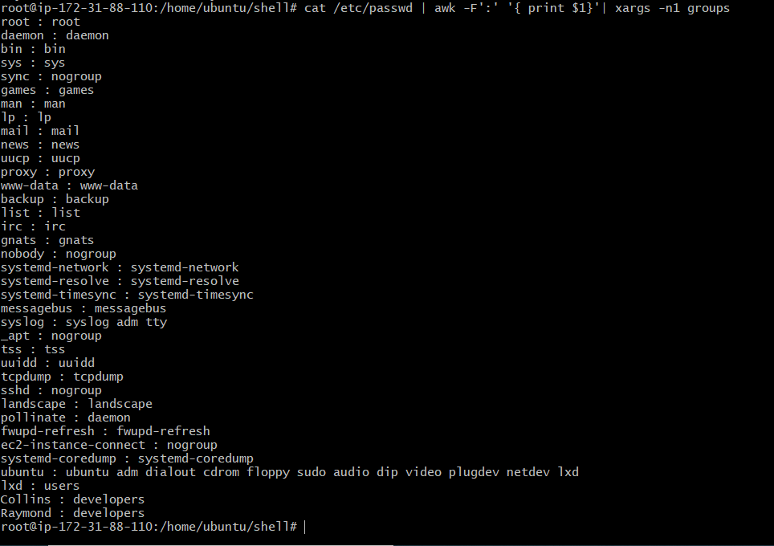

##  **AUX PROJECT 1 (SHELL SCRIPTING) TO ONBOARD DEVELOPERS TO HAVE CONTROLLED ACCESS TO MY SERVER**

## STEP 1 – CREATING .SH FOLDER

### creating the onboarding script

`vi onboard.sh`

### copying onboard file into my ubuntu instance using my public IP address

`scp -i auxkeypair.pe onboard.sh ubuntu@44.203.139.93:~/;`

### Connecting to the remote server

`ssh -i "auxkeypair.pem" ubuntu@ec2-3-83-246-203.compute-1.amazonaws.com`

### Confirming presence of the file copied into the remote server

`ls -l`

### Creating the project directory called 'shell'

`mkdir shell`

### Moving the onboard.sh file to the shell folder

`move onboard.sh /home/ubuntu/shell/`

### Changing directory into shell folder

`cd shell`

### Confirming availability of onboard file in the shell folder

`ls`

### Creating files for public and private keys as well as names.csv 

`touch id_rsa id_rsa.pub names.csv`

### Populating the id_rsa.pub file

`vi id_rsa.pub`

### Populating the id_rsa file

`vi id_rsa`

### Populating the id_rsa file

`vi names.csv`

### Populating the id_rsa file

`vi names.csv`

### Creating developers group

`sudo groupadd developers`

### Making the scrip onboard.sh executable 

`sudo chmod +x onboard.sh`

### Executing the onboard.sh script without sudo priviledge

`./onboard.sh`

### Changing to super user

`sudo su`

### Executing the onboard.sh script with sudo priviledge

`./onboard.sh`

### Confirming existence of the created users in the home directory

`ls -l /home/`

### Confirming the developer group already created

`getent group developers`

### Confirming the detail of developer group

`cat /etc/passwd`

### For further filtering and text analysing

`cat /etc/passwd | awk -F':' '{ print $1}' | xargs -n1 groups`

## LAST STEP – TESTING THE USERS RANDOMLY

### creating .pem private key on the developer window

`ssh -i aux-proj.pem Raymond@100.24.42.23`

`ssh -i aux-proj.pem Collins@100.24.42.23`

### To confirm the users actually do not have sudo priviledg

`sudo apt update`

](./images/ls-la.PNG)

